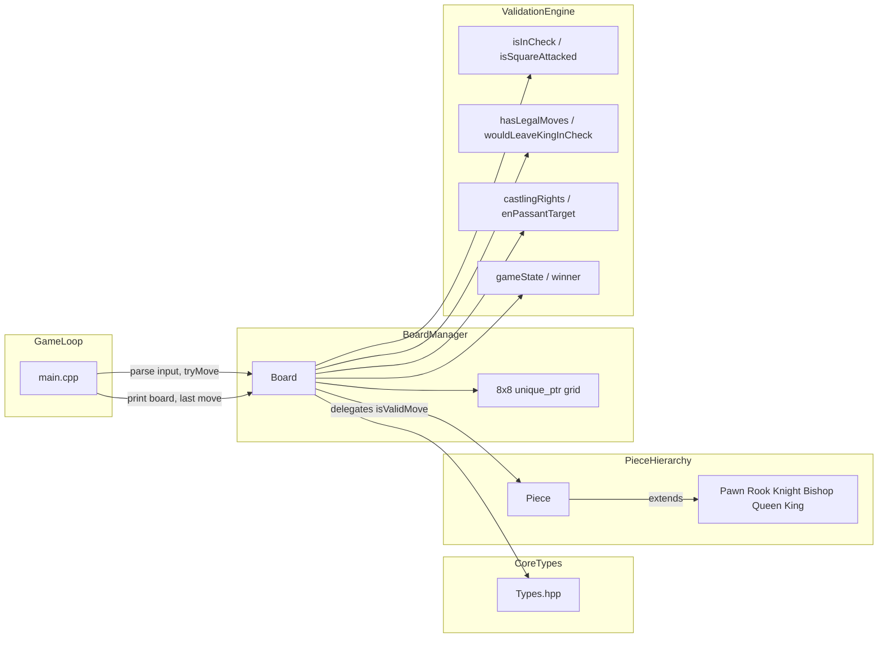

# Chess

A modular, text-based chess engine written in modern C++20. The project separates board state, piece behavior, rule validation, and I/O into distinct layers so each concern can evolve independently without coupling the game loop to low-level move logic.

## Project Overview

This engine implements a full interactive chess session in the terminal: standard setup, legal move enforcement, check and checkmate detection, pawn promotion, castling, en passant, and move history. The codebase targets **C++20** (`-std=c++20`) with strict warnings enabled (`-Wall -Wextra -Wpedantic`) and uses contemporary language features such as `std::optional`, `[[nodiscard]]`, and `std::unique_ptr` for explicit ownership of polymorphic pieces on the board.

The design goal is not merely a playable toy, but a **maintainable foundation**—each rule lives in a well-scoped module, regression tests guard core invariants, and the Makefile provides separate targets for the game binary and the test runner.

## Architecture

The system is organized as a decoupled pipeline from user input to board mutation:

| Layer | Responsibility | Key files |
|-------|----------------|-----------|
| **(a) Type system** | Shared enums and value types: `Color`, `PieceType`, `Position`, `Move`, `GameState`, `CastlingRights` | `include/Types.hpp` |
| **(b) Piece hierarchy** | Polymorphic movement rules per piece type via virtual `isValidMove()` | `include/Piece.hpp`, `include/pieces/*.hpp`, `src/pieces/*.cpp` |
| **(c) Board manager** | 8×8 grid, piece placement, turn state, move application | `include/Board.hpp`, `src/Board.cpp` |
| **(d) Validation engine** | Check detection, legal-move filtering, checkmate/stalemate, castling rights, en passant targets | `src/Board.cpp` |
| **(e) Game loop** | stdin/stdout REPL, algebraic move parsing, game-over handling | `src/main.cpp` |

### Data flow



**Request path:** the game loop parses algebraic notation (`e2 e4`, optional promotion `e7 e8 Q`), calls `Board::tryMove()`, which validates turn ownership, piece rules, check constraints, and special moves before mutating the grid and recording history.

**Rule path:** sliding pieces consult `Board::isPathClear()`; all moves pass through `wouldLeaveKingInCheck()`; terminal states derive from `hasLegalMoves()` combined with `isInCheck()`.

## Dependencies

### Compiler

| Requirement | Detail |
|-------------|--------|
| **C++ standard** | C++20 or later |
| **Recommended** | Apple Clang 17+ (Xcode 15+) or an equivalent recent GCC/Clang toolchain |
| **Build tool** | GNU Make |

Verify your compiler:

```bash
c++ --version
```

### GoogleTest (testing only)

Regression tests link against a **system-installed** GoogleTest build. No third-party code is vendored into this repository.

**macOS (Homebrew, Apple Silicon paths):**

```bash
brew install googletest
```

The Makefile expects Homebrew layout:

- Headers: `/opt/homebrew/include`
- Libraries: `/opt/homebrew/lib`

Intel Macs or custom installs may require adjusting `GTEST_CXXFLAGS` and `GTEST_LDFLAGS` in the `Makefile`.

## Build System and Execution

Clone the repository, then from the project root:

```bash
make          # compile the game binary
./chess       # start an interactive session
```

Additional targets:

| Target | Description |
|--------|-------------|
| `make` / `make all` | Build `./chess` |
| `make run` | Build and launch the game |
| `make clean` | Remove object files and binaries |
| `make DEBUG=1` | Build with `-g -O0` for debugging |

### Move input

Enter moves as two squares separated by a space:

```
e2 e4
g1 f3
e7 e8 Q    # pawn promotion (Q, R, B, or N)
e1 g1      # kingside castling
quit       # exit
```

## Testing

Automated regression tests live under `tests/` and exercise board setup, coordinate mapping, move history, castling, and en passant.

```bash
make test
```

This target:

1. Compiles core library objects (`src/Board.cpp`, `src/pieces/*.cpp`) and test sources (`tests/test_main.cpp`, `tests/test_board.cpp`).
2. Injects Homebrew GoogleTest paths:
   - `-I/opt/homebrew/include`
   - `-L/opt/homebrew/lib -lgtest`
3. Links the `test_runner` binary and executes it immediately.

A passing run reports `[  PASSED  ]` for all test suites. Build artifacts (`chess`, `test_runner`, `*.o`) are listed in `.gitignore`.

## Project layout

```
Chess/
├── Makefile
├── include/
│   ├── Types.hpp
│   ├── Piece.hpp
│   ├── Board.hpp
│   └── pieces/          # concrete piece headers
├── src/
│   ├── main.cpp
│   ├── Board.cpp
│   └── pieces/            # piece implementations
└── tests/
    ├── test_main.cpp
    └── test_board.cpp
```

## License

MIT License

Copyright (c) 2026 Sagar Vemuri

Permission is hereby granted, free of charge, to any person obtaining a copy of this software and associated documentation files (the "Software"), to deal in the Software without restriction, including without limitation the rights to use, copy, modify, merge, publish, distribute, sublicense, and/or sell copies of the Software, and to permit persons to whom the Software is furnished to do so, subject to the following conditions:

The above copyright notice and this permission notice shall be included in all copies or substantial portions of the Software.

THE SOFTWARE IS PROVIDED "AS IS", WITHOUT WARRANTY OF ANY KIND, EXPRESS OR IMPLIED, INCLUDING BUT NOT LIMITED TO THE WARRANTIES OF MERCHANTABILITY, FITNESS FOR A PARTICULAR PURPOSE AND NONINFRINGEMENT. IN NO EVENT SHALL THE AUTHORS OR COPYRIGHT HOLDERS BE LIABLE FOR ANY CLAIM, DAMAGES OR OTHER LIABILITY, WHETHER IN AN ACTION OF CONTRACT, TORT OR OTHERWISE, ARISING FROM, OUT OF OR IN CONNECTION WITH THE SOFTWARE OR THE USE OR OTHER DEALINGS IN THE SOFTWARE.
